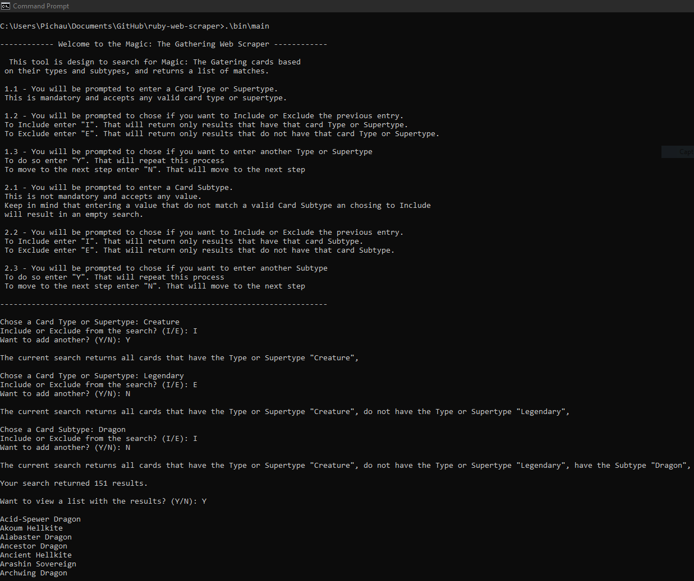

# Web Scraper

> This is the capstone project for the Ruby module on Microverse course. It is a Web Scraper that returns information about cards in a card game called Magic the gathering.

---
              Welcome to the Magic: The Gathering Web Scraper

 This tool is design to search for Magic: The Gatering cards based
 on their types and subtypes, and returns a list of matches.

 1.1 - You will be prompted to enter a Card Type or Supertype.
 This is mandatory and accepts any valid card type or supertype.

 Examples:

 `Chose a Card Type or Supertype: Creature`

 or

 `Chose a Card Type or Supertype: Legendary`

 1.2 - You will be prompted to chose if you want to Include or Exclude the previous entry.
 To Include enter "I". That will return only results that have that card Type or Supertype.
 To Exclude enter "E". That will return only results that do not have that card Type or Supertype.

 Examples:

 `Include or Exclude from the search? (I/E): I`

 or

 `Include or Exclude from the search? (I/E): E`

 1.3 - You will be prompted to chose if you want to enter another Type or Supertype
 To do so enter "Y". That will repeat this process
 To move to the next step enter "N". That will move to the next step

 Examples:

 `Want to add another? (Y/N): Y`

 or

 `Want to add another? (Y/N): N`

 2.1 - You will be prompted to enter a Card Subtype.
 This is not mandatory and accepts any value.
 Keep in mind that entering a value that do not match a valid Card Subtype an chosing to Include
 will result in an empty search.

 Examples:

 `Chose a Card Subtype: Dragon`

 or

 `Chose a Card Subtype: Cat`

 2.2 - You will be prompted to chose if you want to Include or Exclude the previous entry.
 To Include enter "I". That will return only results that have that card Subtype.
 To Exclude enter "E". That will return only results that do not have that card Subtype.

 Examples:

 `Include or Exclude from the search? (I/E): I`

 or

 `Include or Exclude from the search? (I/E): E`

 2.3 - You will be prompted to chose if you want to enter another Subtype
 To do so enter "Y". That will repeat this process
 To move to the next step enter "N". That will move to the next step

 Examples:

 `Want to add another? (Y/N): Y`

 or

 `Want to add another? (Y/N): N`

---

## Built With

- Ruby
- Nokogiri
- Rubocop
- Rspec

## Live Demo

## Getting Started

- Click on the Live demo link above.
- Click and run.

or

- Clone this repository to your local machine.
- Open your terminal.
- From Inside the terminal, `cd` to the "ruby-web-scraper" directory you cloned.
- Type `./bin/main.rb`.

or

- Clone this repository to your local machine.
- Go to the "bin" directory inside the "ruby-web-scraper" directory you cloned.
- Double click the file main.rb to open it.

### Prerequisites

- Ruby
- Nokogiri(gem - for scraping)
- Rspec(gem - for the tests)

### Run tests

- Open your terminal.
- From Inside the terminal, `cd` to the "ruby-web-scraper" directory you cloned.
- Type `rspec`.

## Authors

👤 **Author1**

- GitHub: [@jpdf00](https://github.com/jpdf00)
- Twitter: [@jpdf00](https://twitter.com/jpdf00)
- LinkedIn: [João Paulo Dias França](https://linkedin.com/linkedinhandle)

## 🤝 Contributing

Contributions, issues, and feature requests are welcome!

Feel free to check the [issues page](https://github.com/jpdf00/ruby-web-scraper/issues).

## Show your support

Give a ⭐️ if you like this project!

## 📝 License

This project is [MIT](https://opensource.org/licenses/MIT) licensed.
